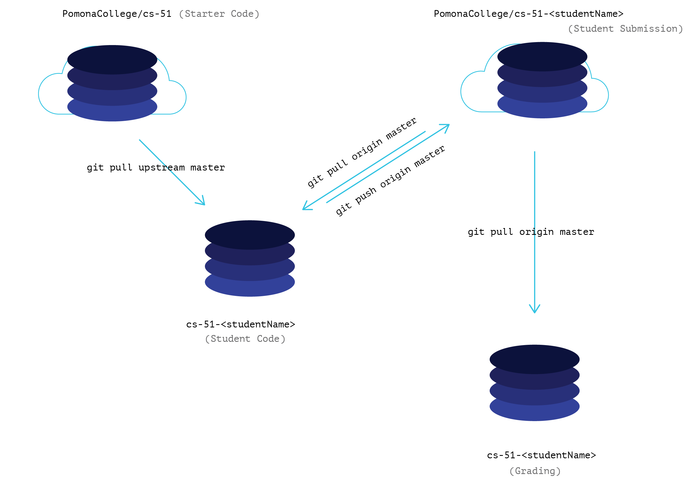

GitHub + Eclipse: A CS051 Proposal
========

* * *
*This proposal has been compiled by [Ross W](mailto:ross.wollman@pomona.edu)
and [Eric C](mailto:eric.campbell@pomona.edu).*

Additional reading and implementation details are linked throughout the document.
To access these materials driectly, browse the top level directory.
* * *

## The Proposal

Run an experimental CS051 Lab Section for Fall 2015, that uses
GitHub and [EGit]() (a standard Eclipse plugin) to optimize the lab
**distribution-submission-feedback** cycle for students, TAs, and professors. 

As an added benefit, the adoption of the proposed workflow would expose students
to the basics of an industry standard versioning tool that promotes incremental
and efficient programming and development.

A success in this implementation of the proposed workflow is defined by
a decrease in overhead and an increase in the quality of grading and feedback.

## Personal Motivation

In our internships this summer, we learned the valuable incremental
version-controlled code-production pattern employed by software companies who 
wish to produce code with low technical debt. We hope to leverage elements from
our internship workflows to optimize the CS051 workflow and share a baseline
knowledge of an invaluable and ubiquitous tool.

## Overview: Why consider GitHub?

### Simplicity: More Coding and More Feedback

Simply put, the ***entire*** distribution-submission-feedback cycle would be
optimized and reduced to **5** basic steps:

| Who              | Action                  | Description                   |
|:-----------------|:-----------------------:|:------------------------------|
| **Professor**    | `publish_lab lab47`     | *makes lab 47 available to all students* |
| **Student**      | `git starterCode && git newLab lab47`| *brings the latest assignment and starter code into the students Eclipse environment and creates a branch for their work*|
| **Student**      | `git submit lab47`      | *pushes the student's work to GitHub for the TA to evaluate* |
| **TA**           | `get_student_code`      | *pulls an entire section's latest submissions from GitHub into the Eclipse environment* |
| **TA**           | [GitHub Commenting][1]  | *allows TA to comment directly on specific lines of student code and leave valuable feedback that the professors can also review and easily add to* |

> **NOTE:** All the student steps can be completed without leaving Eclipse.

From a TA or Professor's perspective, using GitHub could help **maximize the
feedback students receive** on their code by reducing the number of steps
in the grading process. It would simplify the collection of student projects
and facilitate the dissemination of feedback.

### Transparency

With code edits and comments from students, TAs, and professors captured online
by GitHub, course participants will have a history of their development throughout
the semester. This would eliminate the trail of hard-to-follow PDF code emails.

TAs and professors can review eachother's comments for consistency in grading
and **quality assurance** across the lab sections (and different graders).

Professors will have a clear view into the types of problems TAs find in student
code, and an easily accessible histroy of student code a TA feedback will provide
insight into student progress and habits developed throughout the semester.

> **NOTE:** With the [GitHub Education plan (Free)](), all student code will be
> hosted in private locations. Only TAs, professors, and the student
> will have access to viewing/editing their repository.
> They will **NOT** be publicly visible nor will they be visible by other students.

### Dynamic Lab Materials

Another advantage of using GitHub in the development of this new workflow is
its service as a resource for TAs and professors. The source-controlled nature
of the `starter-code/master` repository allows TAs and professors to maintain and 
improve the documention on the use of Git and GitHub as a workflow ***simplification
and optimization tool***.

### The TL;DR: We <3 GitHub

While in its simplest form, GitHub could serve as an
online dropbox that allows for more efficient distribution and collection of
assignments, there are many other features of Git and GitHub that could
enhance the CS051 distribution-submission-feedback cycle.

## *Git*-ing Into It: How Would this Work?

At the begining of the semester, the TAs would [setup private, sandboxed repositories]()
for each student to which students would push their completed assignments. [Eclipse would
be configured with EGit](), so students can complete the entire process without leaving the
IDE.

### General Architecture: The Repositories

1. **Starter Code Repository** (GitHub): Professors would push new lab assignments to this
   repository that will be pull-only for students. This will end up becoming a
   collection of all the lab materials--setup instructions, examplars, and starter-code.
   When an assignment is added, students will be able to easily
   and efficiently pull in the new updates directly into their Eclipse environment.
2. **Student Working Repositories** (Local): Each student will have a repository that
   contains their work on the assignments. This will be configured with Eclipse's
   EGit plugin to make the pushing and pulling updates out of Eclipse seamless.
   With a specifically designed remote scheme, this repository will be able
   to easily pull in updates and new assignments from the Starter Code Repository.
   At the start of the semester students will follow instructions to setup this
   repositry and configure it with [this handy script]().
3. **Submission Repositories** (GitHub): These repositories are GitHub hosted duplicates
   of the student working repositories. Each student will have a private, sandboxed
   repository. Since they are hosted on GitHub, students, TAs, and professors
   can take advantage of GitHub's commenting tools and [Pull Requests]().
4. **TA Clones** (Local): TAs, for their first time grading, will clone and add the
   student GitHub repositories to EGit in Eclipse. This will allow for the grader to
   easily switch between compiling and running different student's code. With one
   command made possible by [this script]() they will be able to pull an entire
   lab sections submissions! 

## EGit

## Adaptations: Working with the Existent Assignments

## Case Studies

### School of Engineering and Design, Institute of Technology (Ireland)

#### Motivation

> "Additionally, within the classroom, there is increasing  pressure on contact
  time with students prompting a refocus on more efficient means of
  communication from lecturer [or TA] to student - and from student to lecturer
  [or TA]. In parallel, a move towards the ‘flipped model’ of student learning
  benefits from a quick, efficient mechanism to round-trip student and lecturer
  exercises back and forth."
> *- John Kelleher*

#### Academic Honesty

> "The issue of substantiating any allegation of plagiarism is fraught. Ideally
  an interview will secure evidence of plagiarism  but may not be practicable
  or cost-effective. However, when work completed by the student is regularly
  pushed to the hosting service, the activity is clearly visualised. Indeed,
  the sudden appearance of an established solution as a single commit served
  to draw attention to the submission, effectively acting as a
  plagiarism alert."
> *- John Kelleher*

#### Drawbacks of GUIs

> "The GUI tools held much promise but were not well received. From feedback
  from students, it appeared that though visually attractive, the range of
  features served to their confound their nascent understanding."
> *- John Kelleher*

### Iowa State University: Principles of Programming Languages Course

#### Distributing Assignments

> "Releasing new homeworks was dead simple. One of the TA’s or the instructor
  would just add a new folder containing the homework files to the main repo."
> *- Josh Davis*

#### Resolving Issues 

> "The great thing is that while the questions were plentiful during Homework
  0, by the time of the first real homework a small percentage of students
  still had issues."
> *- Josh Davis*

#### Overall Thoughts

> "If I had to be a TA again, I would pick to use GitHub in a heartbeat. It
  saved us a ton of time in not only releasing homeworks but grading them."
> *- Josh Davis*

## What Could Go Wrong?

## Implementation Details

This section contains links to scripts and documents that we have compiled
to explain all the details of implementation. They have been tested locally.

<LINKS TO DOCUMENTS>

* * *
#### Links and References
[1]: https://help.github.com/articles/commenting-on-the-diff-of-a-pull-request/

